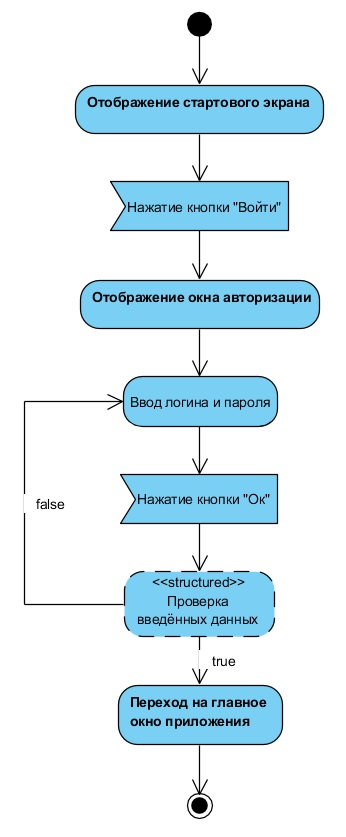
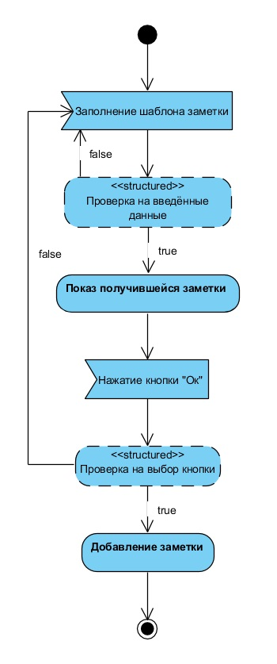
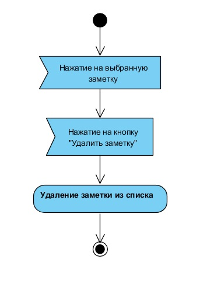
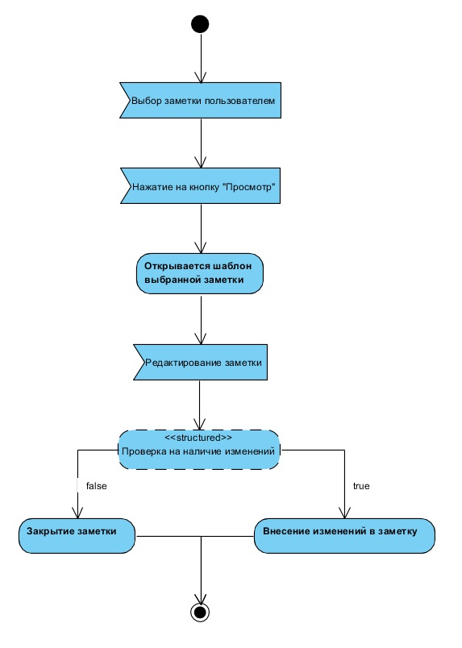
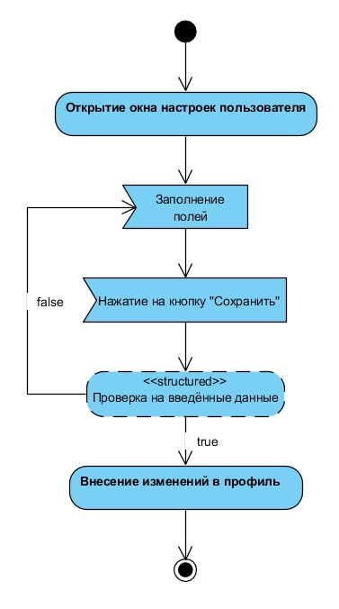

# Содержание
1. [Авторизация в приложении](#1)
2. [Добавление заметки](#2)
3. [Удаление заметки](#3)
4. [Просмотр заметки](#4)
5. [Настройка профиля](#5)

### 1. Авторизация в приложении
При открытии приложения, пользователь видет стартовое окно, где ему предлагают пройти авторизацию. После нажатия кнопки "Войти" приложение отображает окно для ввода данных. После ввода данных, они проверяются на корректность. Если данные ведены правильно, то приложение предоставляет доступ к основным функциям.

### 2. Добавление заметки
При нажатии на кнопку "Добавить заметку" приложение добавит заполненный шаблон в список заметок.

  
### 3. Удаление заметки
При нажатии на кнопку "Удалить заметку" приложение удалит заметку из списка заметок.

### 4. Просмотр заметки
При нажатии кнопки "Просмотр" появится заполненная заметка с возможностью редактирования.

### 5. Настройка профиля
После открытия настроек пользователя есть возможность настроить профиль, изменив несколько параметров.

